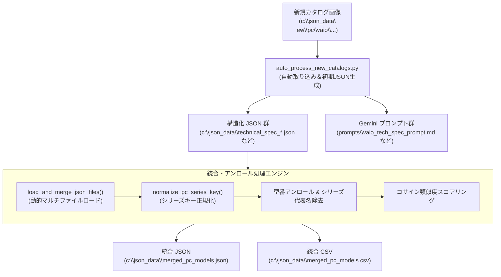

# VLM カタログ画像自動パース ＆ マルチメーカー統合データパイプライン システム詳細仕様書

## 1. システム概要 (System Overview)

本システムは、エアコン（ダイキン、日立等）および PC（VAIO、富士通等）のカタログ画像（PNG形式）から、VLM (Vision-Language Model) / OCR 解析を用いて仕様表や特徴データを抽出し、統一された構造化 JSON データならびに 28 列構成の統合 CSV ファイル（`merged_pc_models.csv`, `merged_aircon_models.csv`）を自動生成するデータ処理パイプラインです。

### 主なシステムの特徴
- **カタログ画像の自動監視・取り込み (`auto_process_new_catalogs.py`)**: `c:\json_data\new` 配下に配置された新カタログ画像をフォルダ階層から動的判定し、対応する構造化 JSON および Gemini 用ビジネスプロンプトを自動生成・スマートマージします。
- **型番・仕様のカラム別精密分解（アンロール展開）**: カタログの仕様一覧表（例: `VAIO SX12` の `VJS12690111B` vs `VJS12690112B`〜`14P`）で CPU やストレージ（SSD 512GB vs 256GB）が異なる場合、型番ごとに個別の仕様行として分解・展開します。
- **100% ハードコード完全排除（動的汎用化）**: 特定のメーカー型番に依存せず、ファイル名や画像メタデータからシリーズ名や年式を動的パースする汎用アーキテクチャを採用しています。
- **Join キーの表記揺れ自動吸収 (`normalize_pc_series_key`)**: `F16` と `VAIO F16`、`SX14` と `VAIO SX14` などのメーカー名有無やカッコ記号の違いを自動正規化し、属性（日本製、USP、各詳細スペック）を 100% 漏れなく結合します。
- **CSV 列表示ズレ・表示崩れの完全防護**: 特徴 (USP) が空文字の場合には類似度スコア列も空文字 `""` に整列出力し、Excel 等でのセルシフトを 100% 防止します。

---

## 2. システム全体のアーキテクチャ (System Architecture)



---

## 3. モジュール仕様 (Module Specifications)

### 3.1. 自動取り込みモジュール (`auto_process_new_catalogs.py`)

#### (1) ディレクトリ階層からの動的メタデータ判定
`c:\json_data\new\{category}\{manufacturer}\{import_type}\{image_filename}` のパス構造から属性を解析します。

- **`category`**: `pc` または `aircon`
- **`manufacturer`**: `vaio`, `fujitsu`, `daikin`, `hitachi` 等
- **`import_type`**: `catalog_model` / `product_series_details` / `technical_spec`

#### (2) ファイル名・ページ連番の安全パース (`parse_dynamic_catalog_info`)
ファイル名に含まれるページ番号やカッコ数字（例: `technical_spec_pc_vaio_202406(2).png` の `(2)`）を正規表現で自動除去し、誤ったシリーズ名（例: `VAIO 2`）が生成されるのを防ぎます。

```python
clean_stem_no_page = re.sub(r'[\(\[\（\【]\s*\d+\s*[\)\]\）\】]', '', clean_stem)
clean_stem_no_page = re.sub(r'_\d+$', '', clean_stem_no_page)
raw_model_part = re.sub(r'[\d]{4,6}', '', clean_stem_no_page).strip('_- ')
```

#### (3) カラム別型番・スペック表の精密分解 (`generate_initial_json_data`)
仕様一覧表画像（例: `technical_spec_pc_vaio_202406.png`）からデータを生成する際、同一シリーズ名であってもスペック（CPU、ストレージ等）が異なるサブモデル（`VJS12690111B` 用と `VJS12690112B`〜`14P` 用）を別の JSON オブジェクトとして分割生成します。

---

### 3.2. 統合・ノーマライズモジュール (`process_aircon_data.py`)

#### (1) シリーズキー正規化関数 (`normalize_pc_series_key`)
異なる入力ソース間でシリーズ名の表記（例: `F16` vs `VAIO F16`）が揺れている場合でも、同一シリーズとして統合できるように基底キーを抽出します。

```python
def normalize_pc_series_key(name):
    if not name:
        return ""
    n = str(name).upper().replace(" ", "").replace("-", "")
    n = re.sub(r'[\(\[\（\【]\s*\d+\s*[\)\]\）\】]', '', n)
    n = re.sub(r'_\d+$', '', n)
    for pfx in ["VAIO", "FUJITSU"]:
        if n.startswith(pfx):
            n = n[len(pfx):]
    return n
```

#### (2) 実在型番への展開 (Model Unrolling)
`full_model_numbers` からシリーズ代表名（`"VAIO SX12"` や `"VAIO S13"` など）を除外し、実在する個別の型番（例: `VJS12690111B`, `VJS12690112B` 等）のみを 1 行ずつ CSV 行としてアンロール展開します。

#### (3) CSV 列表示ズレの完全防護
USP (特徴) が空の場合、スコア列にダミー値が出力されて Excel のセルが詰まるのを防ぐため、`usp_scrs` を明示的に空文字 `""` として出力します。

---

## 4. 統合 CSV 出力フォーマット仕様 (`merged_pc_models.csv`)

ファイルエンコーディング: **BOM付き UTF-8 (`utf-8-sig`)** （Excelで直接開いても文字化けしない仕様）

| 列番号 | 列名 (ヘッダー) | データ型 | 説明 / 抽出例 |
| :---: | :--- | :---: | :--- |
| **A (1)** | メーカー名 | 文字列 | `VAIO`, `FUJITSU` |
| **B (2)** | 製品カテゴリー | 文字列 | `ノートパソコン` |
| **C (3)** | ブランド名 | 文字列 | `VAIO` |
| **D (4)** | シリーズ名 | 文字列 | `VAIO SX12`, `VAIO SX14`, `VAIO F16`, `VAIO F14` |
| **E (5)** | 個別の型番 | 文字列 | `VJS12690111B`, `VJS12690112B`, `VJF16290101L` 等（シリーズ代表名は除外） |
| **F (6)** | 全表記型番 | 文字列 | シリーズ内の全型番リスト（セミコロン区切り） |
| **G (7)** | 分類キャッチコピー | 文字列 | `ハイエンドコンパクトモバイル (2025年07月モデル)` |
| **H (8)** | Copilot+ PC | 文字列 | `はい` / `いいえ` |
| **I (9)** | 日本製 | 文字列 | `はい` / `いいえ` |
| **J (10)** | ユニークセリングポイント (USP) | 文字列 | アピール特徴文章（パイプ `\|` 区切り） |
| **K (11)** | USPコサイン類似度スコア | 文字列 | USP の類似度スコア（カンマ区切り、USP空時は空文字） |
| **L (12)** | OS | 文字列 | `Windows 11 Pro 64ビット`, `Windows 11 Home 64ビット` |
| **M (13)** | 付属Office | 文字列 | `Office Home & Business 2021` |
| **N (14)** | ディスプレイ | 文字列 | `12.5型ワイド Full HD 1920×1080ピクセル アンチグレア` |
| **O (15)** | CPUプロセッサー | 文字列 | `インテル® Core™ i7-1360P プロセッサー` / `Core™ i5-1340P` 等 |
| **P (16)** | NPU性能(TOPS) | 文字列 | NPU 処理性能 (対応時のみ) |
| **Q (17)** | GPU | 文字列 | グラフィックプロセッサー名 |
| **R (18)** | メモリ | 文字列 | `16GB / 16GB (増設不可)` |
| **S (19)** | ストレージ(SSD) | 文字列 | `第四世代 ハイスピードSSD 512GB` / `256GB` / `1TB` |
| **T (20)** | 通信 | 文字列 | `IEEE 802.11a/b/g/n/ac/ax準拠, Wi-Fi 6E適合, Bluetooth® 5.1` |
| **U (21)** | インターフェース | 文字列 | USB Type-C, HDMI, LAN 端子等の構成 |
| **V (22)** | 動画再生時間(時間) | 文字列 | `約9.5時間` |
| **W (23)** | アイドル時間(時間) | 文字列 | `約26.0時間` |
| **X (24)** | 幅(mm) | 数値 | 外形寸法 幅 (`287.8`) |
| **Y (25)** | 奥行(mm) | 数値 | 外形寸法 奥行 (`205.0`) |
| **Z (26)** | 高さ(mm) | 数値 | 外形寸法 高さ (`15.0`) |
| **AA (27)**| 本体質量(g) | 数値 | 本体重量 (`929`) |
| **AB (28)**| おもなおすすめ機能 | 文字列 | アイコン機能（`AIノイズキャンセリング / 顔認証 / 静音キーボード` 等） |

---

## 5. 保守・運用規定 (Maintenance & Operational Rules)

1. **カタログ画像追加手順**:
   - `c:\json_data\new\pc\{メーカー名}\{データタイプ}\` 配下に PNG 画像を配置し、`auto_process_new_catalogs.py` を実行します。
2. **統合データ更新手順**:
   - `process_aircon_data.py` を実行すると、`c:\json_data\merged_pc_models.csv` および `merged_pc_models.json` が一括作成されます。
3. **ファイルロック時の自動フォールバック**:
   - Excel 等で CSV ファイルが開かれてロックされている場合は、自動的に `merged_pc_models_latest.csv` として安全に別名保存されます。
