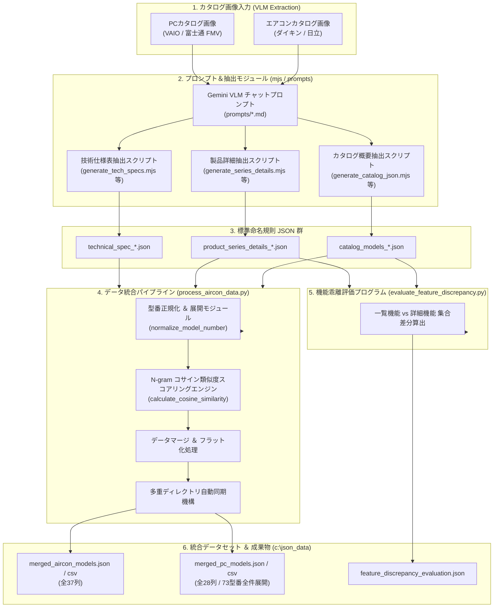

# 製品カタログ VLM データ抽出 ＆ 統合評価パイプライン システム詳細設計書

---

## 1. システム概要 (System Overview)

本システムは、マルチメーカー（ダイキン・日立・VAIO・富士通 FMV 等）およびマルチ製品カテゴリー（壁掛形ルームエアコン、ノートパソコン、一体型デスクトップ）の製品カタログ画像・PDFから、視覚言語モデル (VLM: Vision-Language Model / Google Gemini) を活用して構造化 JSON データを精密に抽出し、N-gram ベクトル空間アルゴリズムによる文字テキスト類似度分析・名寄せ・仕様結合を行って、統合データセット (JSON / CSV) および製品機能乖離の自動評価レポートを生成するエンドツーエンドのデータ統合基盤です。

### 1.1 主な特徴
- **マルチメーカー ＆ マルチカテゴリー対応**: エアコン (ダイキン / 日立) および PC (VAIO / 富士通 FMV) の異種製品ラインナップを単一パイプラインで一元管理。
- **標準ファイル命名規則**: `[取り込みタイプ]_[製品カテゴリー]_[メーカー]_[詳細区分].json` の厳格なファイル構造定義。
- **N-gram コサイン類似度エンジン**: カタログ概要・製品詳細間で表記が揺れる USP (ユニークセリングポイント) のテキスト類似度を数学的に数値化。
- **型番単位の全件ユニーク展開**: 同一シリーズ内の複数型番 (`model_numbers`) を 1 型番 1 行として CSV に独立展開出力。
- **自動同期＆評価機構**: 作業リポジトリと共通データディレクトリ (`c:\json_data`) への自動同期、およびカタログ一覧値と詳細機能値の自動乖離検出評価プログラムを同梱。

---

## 2. システムアーキテクチャ ＆ データフロー (Architecture & Data Flow)

### 2.1 全体パイプライン構成図 (Mermaid)



---

## 3. 標準命名規則 ＆ ファイル構造仕様 (Naming Conventions & Data Files)

本システムで出力・管理されるすべての JSON ファイルは、以下の命名規則に厳格に準拠します。

### 3.1 命名ルールフォーマット
```text
[取り込みタイプ]_[製品カテゴリー]_[メーカー]_[詳細/シリーズ区分 (任意)].json
```

- **取り込みタイプ**:
  - `catalog_models`: カタログ一覧・概要ページからの抽出
  - `product_series_details`: 製品詳細・特集ページからの抽出
  - `technical_spec`: 仕様一覧表 (JIS規格/スペック表) からの抽出
- **製品カテゴリー**:
  - `aircon`: 壁掛形ルームエアコン
  - `pc`: ノートパソコン / 一体型デスクトップ
- **メーカー**:
  - `daikin`: ダイキン工業
  - `hitachi`: 日立製作所 (`白くまくん`)
  - `vaio`: VAIO株式会社
  - `fujitsu`: 富士通 (`FMV`)

### 3.2 現行ファイル一覧マップ

| 取り込みタイプ | 製品カテゴリー | メーカー | 標準命名規則ファイル名 | 抽出元データ内容 |
| :--- | :--- | :--- | :--- | :--- |
| カタログ概要 | エアコン | ダイキン | `catalog_models_aircon_daikin.json` | RXシリーズ等概要 50モデル |
| カタログ概要 | エアコン | 日立 | `catalog_models_aircon_hitachi.json` | 白くまくん概要 49モデル |
| カタログ概要 | PC | VAIO | `catalog_models_pc_vaio.json` | Index P.02 6シリーズ |
| カタログ概要 | PC | 富士通 | `catalog_models_pc_fujitsu.json` | Lineup P.05-06 5モデル |
| 製品詳細 | エアコン | ダイキン | `product_series_details_aircon_daikin_rx.json` | RX詳細 P.03-04 15モデル |
| 製品詳細 | エアコン | 日立 | `product_series_details_aircon_hitachi_x.json` | Xシリーズ詳細 P.20 10モデル |
| 製品詳細 | PC | VAIO | `product_series_details_pc_vaio_sx14r.json` | SX14-R詳細 P.03-04 1モデル |
| 製品詳細 | PC | 富士通 | `product_series_details_pc_fujitsu_ua-k1_ux-k3.json` | P.07 上下2段モデル 2モデル |
| 技術仕様表 | エアコン | ダイキン | `technical_spec_aircon_daikin.json` | 仕様一覧表 12モデル |
| 技術仕様表 | エアコン | 日立 | `technical_spec_aircon_hitachi.json` | 仕様一覧表 40モデル |
| 技術仕様表 | PC | VAIO | `technical_spec_pc_vaio.json` | 仕様表①③ 4シリーズ |
| 技術仕様表 | PC | 富士通 | `technical_spec_pc_fujitsu.json` | 仕様表 P.01-04 11シリーズ |

---

## 4. データ統合パイプライン モジュール設計 (`process_aircon_data.py`)

`process_aircon_data.py` は、本システムのコアエンジンであり、異種形式のデータを一括マージ・スコアリング・CSV展開・同期コピーするPythonスクリプトです。

### 4.1 主要アルゴリズムと関数仕様

#### ① N-gram 文字ベクトル コサイン類似度算出エンジン
USP (ユニークセリングポイント) 等の自由記述テキストについて、バイグラム (2-gram) 文字ベクトルを生成し、内積・ノルムからコサイン類似度スコア (0.0〜1.0) を算出します。

```python
def get_ngrams(text):
    """テキストを小文字化・空白除去後、2文字ごとのN-gram頻度Counterを返す"""
    cleaned = re.sub(r'\s+', '', str(text)).lower()
    if len(cleaned) < 2:
        return Counter([cleaned])
    return Counter([cleaned[i:i+2] for i in range(len(cleaned) - 1)])

def calculate_cosine_similarity(str1, str2):
    """2つの文字列のN-gramベクトル間コサイン類似度を算出"""
    vec1, vec2 = get_ngrams(str1), get_ngrams(str2)
    intersection = set(vec1.keys()) & set(vec2.keys())
    dot_product = sum(vec1[x] * vec2[x] for x in intersection)
    norm1 = math.sqrt(sum(val ** 2 for val in vec1.values()))
    norm2 = math.sqrt(sum(val ** 2 for val in vec2.values()))
    if norm1 == 0 or norm2 == 0:
        return 0.0
    return round(dot_product / (norm1 * norm2), 3)
```

#### ② 型番の正規化 ＆ 抽出モジュール
ダイキン・日立のエアコン型番の補足文字・カラーコード切捨てや、PC製品の複数型番配列 (`model_numbers`) から単一・複数の型番セットを名寄せ抽出します。

- `normalize_model_number(model_str)`: エアコン型番 (例: `S22ATRS-W(-C)` ➔ `S22ATRS`, `RAS-XR2226S` ➔ `RAS-X2226S`)
- `normalize_pc_series_key(series_str)`: PCシリーズ名正規化 (例: `FMV Note U (UA-K1)` ➔ `note u`)
- `extract_model_numbers_from_item(item)`: 配列・文字列双方のフィールド (`model_numbers`, `model_number`, `product_code`) からソート済み型番リストを抽出。

#### ③ PC統合パイプライン (`process_pc_data_integration`)
1. **基盤登録**: 仕様表 JSON (`technical_spec_pc_*.json`) を読み込み、シリーズ・型番キーでエントリーを生成。
2. **概要・詳細統合**: カタログ概要および製品詳細 JSON をマッチングし、`category_description`, `copilot_plus_pc`, `unique_selling_point_sources`, `recommended_features` を属性統合。
3. **スコアリング**: 収集された USP の全ペアについて N-gram コサイン類似度スコア配列を計算。
4. **型番単位1行独立展開 CSV 出力**: `full_model_numbers` 配列内の各型番 (`single_model`) についてルーピングし、1 型番につき 1 行の独立行として `merged_pc_models.csv` へ出力。

---

## 5. CSV 出力データ項目定義 (CSV Column Schema)

### 5.1 PC 統合 CSV (`merged_pc_models.csv`: 全 28 列 / BOM付き UTF-8)

| 列番号 | ヘッダー名 | データ型 | 説明・例 |
| :---: | :--- | :---: | :--- |
| 1 | `メーカー名` | String | `VAIO` / `富士通` |
| 2 | `製品カテゴリー` | String | `ノートパソコン` / `一体型デスクトップ` |
| 3 | `ブランド名` | String | `VAIO` / `FMV` |
| 4 | **`シリーズ名`** | String | `VAIO SX14-R` / `Note U (UA-K1)` |
| 5 | **`個別の型番`** | String | **`VJS14R19011B` / `FMVUASK1BA` (型番単位で1行独立展開)** |
| 6 | `全表記型番` | String | セミコロン区切りのシリーズ全型番一覧 |
| 7 | `分類キャッチコピー` | String | `ハイスペックモバイルノート` |
| 8 | `Copilot+ PC` | String | `はい` / `いいえ` |
| 9 | `日本製` | String | `はい` / `いいえ` |
| 10 | `ユニークセリングポイント (USP)` | String | パイプ `\|` 区切りの抽出USPテキスト一覧 |
| 11 | `USPコサイン類似度スコア` | String | カンマ区切りのN-gram類似度スコア配列 |
| 12 | `OS` | String | `Windows 11 Home` |
| 13 | `付属Office` | String | `Microsoft 365 Basic + Office Home & Business 2024` |
| 14 | `ディスプレイ` | String | `14.0型ワイド (狭額縁) 1920×1200ドット ノングレア` |
| 15 | `CPUプロセッサー` | String | `インテル® Core™ Ultra 7 プロセッサー 258V` |
| 16 | `NPU性能(TOPS)` | String | `インテル® AI Boost (最大47TOPS)` |
| 17 | `GPU` | String | `インテル® Arc™ グラフィックス 140V` |
| 18 | `メモリ` | String | `32GB (LPDDR5X-8533)` |
| 19 | `ストレージ(SSD)` | String | `約512GB SSD (PCIe Gen4)` |
| 20 | `通信` | String | `Wi-Fi 7 (5.76Gbps対応), Bluetooth®` |
| 21 | `インターフェース` | String | `Thunderbolt 4×2 / USB 3.2×2 / HDMI×1` |
| 22 | `動画再生時間(時間)` | Numeric | `15.5` |
| 23 | `アイドル時間(時間)` | Numeric | `36.0` |
| 24 | `幅(mm)` | Numeric | `308.8` |
| 25 | `奥行(mm)` | Numeric | `209.0` |
| 26 | `高さ(mm)` | Numeric | `15.8` |
| 27 | `本体質量(g)` | Numeric | `848` |
| 28 | `おもなおすすめ機能` | String | 便利機能・AI機能の斜線 `/` 区切り一覧 |

---

### 5.2 エアコン 統合 CSV (`merged_aircon_models.csv`: 全 37 列 / BOM付き UTF-8)

メーカー名, 製品カテゴリー, ブランド名, ベース型番, 全表記型番, シリーズ名, 愛称, 年式, 畳数目安, 冷房能力(kW), ユニークセリングポイント (USP), USPコサイン類似度スコア, 税込価格 (円), 税抜価格 (円), 価格コサイン類似度スコア, 室内機型番, 室内機質量 (kg), 室内機寸法_幅 (mm), 室内機寸法_高さ (mm), 室内機寸法_奥行 (mm), 室外機型番, 室外機質量 (kg), 室外機寸法_幅 (mm), 室外機寸法_高さ (mm), 室外機寸法_奥行 (mm), 電源規格, 配管径_液 (mm), 配管径_ガス (mm), 暖房能力 (kW), 暖房消費電力 (W), 冷房能力 (kW), 冷房消費電力 (W), 年間消費電力量 (kWh), APF, 冷媒種類, 冷媒封入量 (kg), GWP, おもなおすすめ機能

---

## 6. 機能乖離自動評価プログラム設計 (`evaluate_feature_discrepancy.py`)

本プログラムは、カタログ一覧で訴求されている「おもなおすすめ機能」と、製品詳細ページで定義されている「機能詳細」の間に表現や存在の齟齬・乖離がないかを全自動で数学的に評価・検証するスクリプトです。

### 6.1 評価アルゴリズム
1. **カタログ一覧マップの構築**: `catalog_models_*.json` から型番別に `recommended_features` のフラット集合 $F_{\text{catalog}}$ を生成。
2. **製品詳細マップの構築**: `product_series_details_*.json` から型番別に `functions` のフラット集合 $F_{\text{details}}$ を生成。
3. **集合差分の算出**:
   - カタログのみに存在: $D_{\text{catalog}} = F_{\text{catalog}} \setminus F_{\text{details}}$
   - 詳細のみに存在: $D_{\text{details}} = F_{\text{details}} \setminus F_{\text{catalog}}$
   - 共通一致機能: $C = F_{\text{catalog}} \cap F_{\text{details}}$
4. **乖離判定**: $D_{\text{catalog}} \neq \emptyset$ または $D_{\text{details}} \neq \emptyset$ の場合、`has_discrepancy = true` と判定。

### 6.2 評価出力形式 (`feature_discrepancy_evaluation.json`)
```json
{
  "evaluation_summary": {
    "total_evaluated_models": 104,
    "matched_models_count": 0,
    "discrepancy_models_count": 104,
    "discrepancy_rate_percent": 100.0
  },
  "model_evaluations": [
    {
      "manufacturer": "ダイキン",
      "model_number": "S22ATRS",
      "series_name": "RXシリーズ",
      "has_discrepancy": true,
      "discrepancy_details": {
        "in_catalog_only_count": 4,
        "in_catalog_only": ["うるさらAI", "給気換気", "無給水加湿", "水内部クリーン"],
        "in_details_only_count": 12,
        "in_details_only": ["AI快適自動運転", "サーキュレーション気流", "プレミアム冷房", "センサー風向"]
      },
      "comparison_pair": { ... }
    }
  ]
}
```

---

## 7. 運用 ＆ VLM プロンプト連携設計 (`prompts/`)

非エンジニアやビジネスユーザーが Gemini Web UI や Google AI Studio で直感的に画像から高品質な JSON データを抽出できるよう、専用プロンプトテンプレート群を用意しています。

### 7.1 プロンプト一覧と役割
- `prompts/vaio_catalog_prompt.md`: VAIO カタログ Index (P.02) 抽出用
- `prompts/vaio_series_detail_prompt.md`: VAIO SX14-R 詳細 (P.03-04) 抽出用
- `prompts/vaio_tech_spec_prompt.md`: VAIO 仕様一覧表 (P.25-30) 抽出用
- `prompts/fujitsu_catalog_prompt.md`: 富士通 FMV Lineup (P.05-06) 抽出用
- `prompts/fujitsu_series_detail_prompt.md`: 富士通 FMV 製品詳細 (P.07 上下2段レイアウト) 抽出用
- `prompts/fujitsu_tech_spec_prompt.md`: 富士通 FMV 仕様一覧表 (P.01-04) 抽出用
- `prompts/hitachi_catalog_prompt.md`: 日立エアコン一覧 抽出用
- `prompts/hitachi_series_detail_prompt.md`: 日立エアコン Xシリーズ詳細 抽出用
- `prompts/hitachi_tech_spec_prompt.md`: 日立エアコン JIS仕様一覧表 抽出用

### 7.2 ビジネスユーザー運用手順
1. 指定のカタログページ画像を Gemini チャット画面にアップロード。
2. 対応する `prompts/*.md` のプロンプトテキストをコピー＆ペーストして送信。
3. 出力された JSON コードブロックをコピーし、指定の標準命名規則ファイル名で保存。
4. `python process_aircon_data.py` を実行して一括マージ・CSV化・同期を完了。
