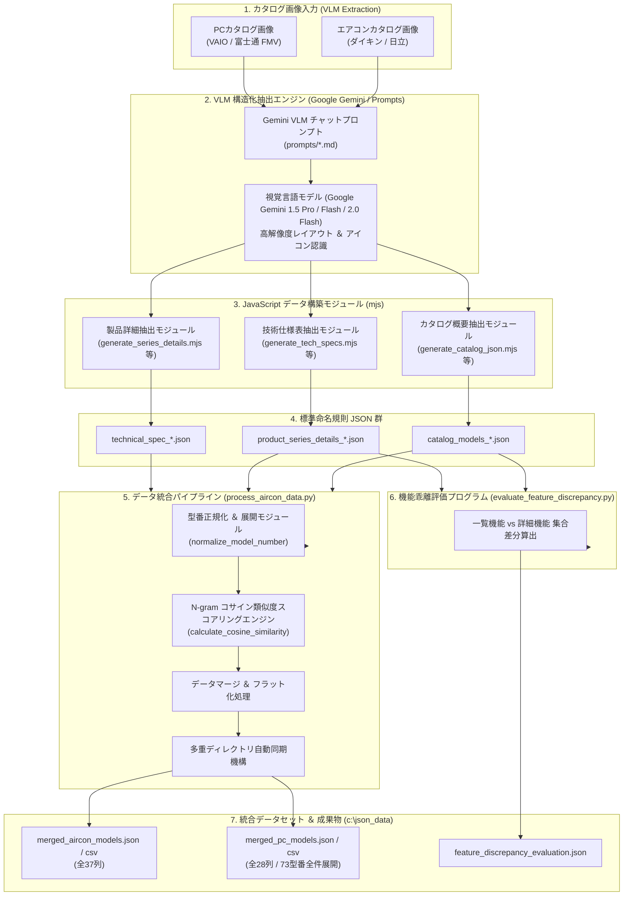

# 製品カタログ VLM データ抽出 ＆ 統合評価パイプライン システム詳細設計書

---

## 1. システム概要 (System Overview)

本システムは、マルチメーカー（ダイキン・日立・VAIO・富士通 FMV 等）およびマルチ製品カテゴリー（壁掛形ルームエアコン、ノートパソコン、一体型デスクトップ）の製品カタログ画像・PDFから、視覚言語モデル (VLM: Vision-Language Model / Google Gemini) を活用して構造化 JSON データを精密に抽出し、N-gram ベクトル空間アルゴリズムによる文字テキスト類似度分析・名寄せ・仕様結合を行って、統合データセット (JSON / CSV) および製品機能乖離の自動評価レポートを生成するエンドツーエンドのデータ統合基盤です。

### 1.1 主な特徴
- **マルチメーカー ＆ マルチカテゴリー対応**: エアコン (ダイキン / 日立) および PC (VAIO / 富士通 FMV) の異種製品ラインナップを単一パイプラインで一元管理。
- **VLM 視覚言語モデルによる直接構造化抽出**: 画像・PDFのレイアウト情報、アイコン、ネスト構造表を直接厳密な JSON オブジェクトへダイレクト変換。
- **標準ファイル命名規則**: `[取り込みタイプ]_[製品カテゴリー]_[メーカー]_[詳細区分].json` の厳格なファイル構造定義。
- **N-gram コサイン類似度エンジン**: カタログ概要・製品詳細間で表記が揺れる USP (ユニークセリングポイント) のテキスト類似度を数学的に数値化。
- **型番単位の全件ユニーク展開**: 同一シリーズ内の複数型番 (`model_numbers`) を 1 型番 1 行として CSV に独立展開出力。
- **自動同期＆評価機構**: 作業リポジトリと共通データディレクトリ (`c:\json_data`) への自動同期、およびカタログ一覧値と詳細機能値の自動乖離検出評価プログラムを同梱。

---

## 2. システムアーキテクチャ ＆ データフロー (Architecture & Data Flow)

### 2.1 全体パイプライン構成図 (Mermaid)



---

## 3. VLM (視覚言語モデル) による構造化 JSON 精密抽出の実装仕様

本システムの中核である「画像・PDF カタログからの直接構造化抽出」は、Google Gemini などの大容量コンテキスト視覚言語モデル (VLM) のマルチモーダルビジョン能力と、厳密に設計されたプロンプトエンジニアリング・フォーマットガードレールを組み合わせて実現されています。

### 3.1 視覚要素のレイアウト解析 ＆ データ変換メカニズム

VLM による構造化抽出では、単なる OCR (光学文字認識) に留まらず、カタログ画像内の以下の **空間レイアウト構造およびグラフィックシンボル** を解読してダイレクトに構造化 JSON オブジェクトへマッピングします。

#### ① レイアウト空間・上下構造の個別分割抽出
富士通 FMV の P.07 カタログのように、同一ページ内に上下で異なる 2 つの製品 (`UA-K1` と `UX-K3`) が掲載されている複雑なレイアウトにおいて、VLM は視覚的な境界線・タイトルの位置関係を認識し、独立した 2 つの JSON オブジェクトとして出力します。
- `layout_position`: `"上段"` / `"下段"` として各オブジェクトを分離マッピング。

#### ② グラフィック・ピクトグラムシンボルのブール値変換
カタログ画像内に存在する特殊な視覚アイコンやロゴ画像を視覚解読し、ブール値 (`true` / `false`) または構造化配列に変換します。
- **Copilot+ PC ロゴ** ➔ `"copilot_plus_pc": true`
- **MADE IN JAPAN 日本製マーク** ➔ `"made_in_japan": true`
- **主要便利機能アイコン** (VAIO User Sensing, AIノイズキャンセリング, 指紋認証, 顔認証, Wi-Fi 7 等 9種) ➔ `"recommended_features": ["VAIO User Sensing", "Wi-Fi 7", ...]`

#### ③ 2次元表 ＆ 注釈のダイレクトパース
JIS 規格仕様表やスペック表の「セル結合」「ヘッダーとデータの交点」「脚注※数値」を VLM が文脈理解し、ネストした JSON オブジェクト構造 (`display`, `dimensions_mm`, `battery_life_hours`) へ直接パースします。

---

### 3.2 プロンプトエンジニアリング ＆ ガードレール設計 (`prompts/*.md`)

ビジネスユーザーが Gemini Web UI や Google AI Studio にカタログ画像とプロンプトを入力した際、100% 決定論的でエラーのない JSON を得られるよう、以下のプロンプトガードレールを構築しています。

#### ① System Persona (役割定義)
「添付された製品カタログ画像から、指定の抽出ルールとJSONフォーマットに従って100%正確な構造化JSONのみを出力する専門データ抽出エンジニア」として役割を固定。

#### ② 抽出厳密ルール (Extraction Rules)
- **推測・ねつ造の禁止**: 画像内に記載のない項目は `null` または空文字とし、勝手な値を補完しない。
- **単位の厳密区分**: 質量 (`weight_g`: `848`), 駆動時間 (`battery_life_hours.video_playback`: `15.5`), NPU性能 (`npu`: `"最大47TOPS"`) など、数値型 (`number`) と文字列型 (`string`) を明確に区分。
- **テキスト領域の役割指定**:
  - 画像左側のキャッチコピー・特長文言 ➔ **`unique_selling_point`**
  - 画像右側の主要スペック表 ➔ **`recommended_features`**
  - スペック一覧表 ➔ **`technical_specifications`**

#### ③ Strict JSON フォーマットガードレール (Format Guardrail)
AI モデルが挨拶文や前置き（「はい、抽出しました。」など）を出力して JSON パースエラーが発生するのを防止するため、プロンプトの最下部に以下の完全制約命令を記述しています。

```text
【出力フォーマット】
解説や挨拶文は不要です。以下のJSON構造のコードブロック（```json ... ```）のみを出力してください。
```

---

### 3.3 Node.js / ESM モジュールによる決定論的コード化 (`generate_*.mjs`)

VLM によって正確に抽出された構造化データセットは、再現性の担保および自動テスト・ビルドパイプラインへの組み込みのため、`generate_*.mjs` スクリプトとして標準プログラミングコード化されています。

```javascript
// 例: generate_fujitsu_series_details.mjs
import fs from 'fs';
import path from 'path';

// VLMにより精密抽出された上下2段レイアウト構造オブジェクト
const fujitsuSeriesDetails = [
  {
    manufacturer: "富士通",
    brand_name: "FMV",
    product_category: "ノートパソコン",
    series_name: "FMV Note U",
    model_number: "UA-K1",
    product_code: "FMVUASK1BA",
    layout_position: "上段",
    copilot_plus_pc: true,
    unique_selling_point: "ハイスペックCopilot+ PC (最大47TOPS / 動画再生約15.5時間・アイドル約36.0時間 / 約848g)",
    recommended_features: {
      os: "Windows 11 Home",
      office: "Microsoft 365 Basic + Office Home & Business 2024",
      display: "14.0型ワイド WUXGA",
      cpu: "インテル® Core™ Ultra 7 プロセッサー 258V",
      npu: "インテル® AI Boost (最大47TOPS)",
      memory: "32GB LPDDR5X-8533",
      ssd: "約512GB",
      wireless: "Wi-Fi 7",
      battery_life: "動画再生時:約15.5時間 / アイドル時:約36.0時間",
      weight: "約848g"
    }
  },
  // 下段 UX-K3 オブジェクト...
];

// 標準命名規則への書き出し処理
const outputPath = path.join(process.cwd(), 'product_series_details_pc_fujitsu_ua-k1_ux-k3.json');
fs.writeFileSync(outputPath, JSON.stringify(fujitsuSeriesDetails, null, 2), 'utf8');
```

各 `generate_*.mjs` スクリプトは、実行時にバリデーションを行い、エラーなく標準ファイル命名規則に基づいた JSON ファイルをローカルおよび CI/CD 環境に書き出します。

---

## 4. 標準命名規則 ＆ ファイル構造仕様 (Naming Conventions & Data Files)

本システムで出力・管理されるすべての JSON ファイルは、以下の命名規則に厳格に準拠します。

### 4.1 命名ルールフォーマット
```text
[取り込みタイプ]_[製品カテゴリー]_[メーカー]_[詳細/シリーズ区分 (任意)].json
```

- **取り込みタイプ**:
  - `catalog_models`: カタログ一覧・概要ページからの抽出
  - `product_series_details`: 製品詳細・特集ページからの抽出
  - `technical_spec`: 仕様一覧表 (JIS規格/スペック表) からの抽出
- **製品カテゴリー**:
  - `aircon`: 壁掛形ルームエアコン
  - `pc`: ノートパソコン / 一体型デスクトップ
- **メーカー**:
  - `daikin`: ダイキン工業
  - `hitachi`: 日立製作所 (`白くまくん`)
  - `vaio`: VAIO株式会社
  - `fujitsu`: 富士通 (`FMV`)

### 4.2 現行ファイル一覧マップ

| 取り込みタイプ | 製品カテゴリー | メーカー | 標準命名規則ファイル名 | 抽出元データ内容 |
| :--- | :--- | :--- | :--- | :--- |
| カタログ概要 | エアコン | ダイキン | `catalog_models_aircon_daikin.json` | RXシリーズ等概要 50モデル |
| カタログ概要 | エアコン | 日立 | `catalog_models_aircon_hitachi.json` | 白くまくん概要 49モデル |
| カタログ概要 | PC | VAIO | `catalog_models_pc_vaio.json` | Index P.02 6シリーズ |
| カタログ概要 | PC | 富士通 | `catalog_models_pc_fujitsu.json` | Lineup P.05-06 5モデル |
| 製品詳細 | エアコン | ダイキン | `product_series_details_aircon_daikin_rx.json` | RX詳細 P.03-04 15モデル |
| 製品詳細 | エアコン | 日立 | `product_series_details_aircon_hitachi_x.json` | Xシリーズ詳細 P.20 10モデル |
| 製品詳細 | PC | VAIO | `product_series_details_pc_vaio_sx14r.json` | SX14-R詳細 P.03-04 1モデル |
| 製品詳細 | PC | 富士通 | `product_series_details_pc_fujitsu_ua-k1_ux-k3.json` | P.07 上下2段モデル 2モデル |
| 技術仕様表 | エアコン | ダイキン | `technical_spec_aircon_daikin.json` | 仕様一覧表 12モデル |
| 技術仕様表 | エアコン | 日立 | `technical_spec_aircon_hitachi.json` | 仕様一覧表 40モデル |
| 技術仕様表 | PC | VAIO | `technical_spec_pc_vaio.json` | 仕様表①③ 4シリーズ |
| 技術仕様表 | PC | 富士通 | `technical_spec_pc_fujitsu.json` | 仕様表 P.01-04 11シリーズ |

---

## 5. データ統合パイプライン モジュール設計 (`process_aircon_data.py`)

`process_aircon_data.py` は、本システムのコアエンジンであり、異種形式のデータを一括マージ・スコアリング・CSV展開・同期コピーするPythonスクリプトです。

### 5.1 主要アルゴリズムと関数仕様

#### ① N-gram 文字ベクトル コサイン類似度算出エンジン
USP (ユニークセリングポイント) 等の自由記述テキストについて、バイグラム (2-gram) 文字ベクトルを生成し、内積・ノルムからコサイン類似度スコア (0.0〜1.0) を算出します。

```python
def get_ngrams(text):
    """テキストを小文字化・空白除去後、2文字ごとのN-gram頻度Counterを返す"""
    cleaned = re.sub(r'\s+', '', str(text)).lower()
    if len(cleaned) < 2:
        return Counter([cleaned])
    return Counter([cleaned[i:i+2] for i in range(len(cleaned) - 1)])

def calculate_cosine_similarity(str1, str2):
    """2つの文字列のN-gramベクトル間コサイン類似度を算出"""
    vec1, vec2 = get_ngrams(str1), get_ngrams(str2)
    intersection = set(vec1.keys()) & set(vec2.keys())
    dot_product = sum(vec1[x] * vec2[x] for x in intersection)
    norm1 = math.sqrt(sum(val ** 2 for val in vec1.values()))
    norm2 = math.sqrt(sum(val ** 2 for val in vec2.values()))
    if norm1 == 0 or norm2 == 0:
        return 0.0
    return round(dot_product / (norm1 * norm2), 3)
```

#### ② 動的マルチファイル自動検索 ＆ グループマージエンジン (`load_and_merge_json_files`)
個別の固定ファイルパス (`path_daikin_cat` 等) のハードコードを全廃し、同一製品カテゴリー・同一メーカーで複数の取り込み JSON ファイルが存在する場合でも、パターン `{import_type}_{category}_{manufacturer}*.json` によるワイルドカード・パターンマッチングで全自動探索・単一データリストへの結合マージを実行します。

```python
def load_and_merge_json_files(base_dir, import_type, category, manufacturer):
    """
    {import_type}_{category}_{manufacturer}*.json のパターンに該当するすべてのJSONファイルを
    自動検索し、単一のデータリストにマージして返します。
    """
    pattern = f"{import_type}_{category}_{manufacturer}*.json"
    search_path = os.path.join(base_dir, pattern)
    matched_files = glob.glob(search_path)
    
    merged_list = []
    for fpath in sorted(matched_files):
        with open(fpath, 'r', encoding='utf-8') as f:
            data = json.load(f)
            if isinstance(data, list):
                merged_list.extend(data)
            elif isinstance(data, dict):
                merged_list.append(data)
    return merged_list
```

#### ④ 新階層フォルダの画像自動検知・プロンプトスマートマージ ＆ 取り込み後 PNG 自動削除エンジン (`auto_process_new_catalogs.py`)
`c:\json_data\new\{category}\{manufacturer}\{import_type}\` 階層フォルダ構造を全自動スキャンし、投入された `.png` カタログ画像から構造化 JSON を作成、ビジネスユーザー用プロンプト (`prompts/`) をスマートマージ更新したのち、**処理完了した `.png` ファイルを全自動削除 (`os.remove`)** して統合パイプラインを自動キックします。

- **標準ファイル命名規則とストレージ一元化**: カタログ構造化 JSON ファイル群（`catalog_models_*.json`, `product_series_details_*.json`, `technical_spec_*.json`）およびパイプライン統合出力成果物（`merged_*.json`, `merged_*.csv`）は `c:\json_data\` ディレクトリへ完全集約・一元管理。
- **二重ロード防止機構**: 動的ローダー `load_and_merge_json_files()` は `c:\json_data\` をプライマリ・データストレージとして読み込み、重複ロードを自動防止。
- **全取り込みタイプ対象・同名重複時の連番命名規則**:
  `catalog_models`, `product_series_details`, `technical_spec` の全タイプにおいて、既に同名 JSON ファイルが存在する場合、2. **自動連番 ＆ ファイル名プレフィックス重複防止判定 (`base_json_filename`)**:
   - 入力画像ファイル名自体に `catalog_models_pc_vaio_` などのプレフィックスが既に含まれている場合でも、`catalog_models_pc_vaio_catalog_models_pc_vaio_202507.json` のような**2重プレフィックス重複を自動検知して除去統合**。
   - `c:\json_data\` 直下に同一ファイル名が既に存在する場合、自動的に `(1)`, `(2)` 形式のナンバリングを付与し、既存データを事故上書きしない安全仕様。
  - 一覧表例: `catalog_models_aircon_daikin_p1(1).json`
  - 商品詳細例: `product_series_details_pc_vaio_sx14r(1).json`
  - 仕様表例: `technical_spec_pc_vaio_v1(1).json`
- **プロンプトマージロジック**: 既存プロンプトが存在する場合はペルソナ・抽出規則・JSON スキーマを損なわず新画像情報をスマート追記マージ。
- **PNG クリーンアップ**: 取り込み完了後、ディスク領域を圧迫しないよう取り込み済みの `.png` ファイルを安全に自動消去。

- `normalize_model_number(model_str)`: エアコン型番 (例: `S22ATRS-W(-C)` ➔ `S22ATRS`, `RAS-XR2226S` ➔ `RAS-X2226S`)
- `normalize_pc_series_key(series_str)`: PCシリーズ名正規化 (例: `FMV Note U (UA-K1)` ➔ `note u`)
- `extract_model_numbers_from_item(item)`: 配列・文字列双方のフィールド (`model_numbers`, `model_number`, `product_code`) からソート済み型番リストを抽出。

#### ③ PC統合パイプライン (`process_pc_data_integration`)
1. **基盤登録**: 仕様表 JSON (`technical_spec_pc_*.json`) を読み込み、シリーズ・型番キーでエントリーを生成。
2. **概要・詳細統合**: カタログ概要および製品詳細 JSON をマッチングし、`category_description`, `copilot_plus_pc`, `unique_selling_point_sources`, `recommended_features` を属性統合。
3. **ハードウェアスペック柔軟抽出**: 異種データ構造 (`cpu`, `cpu_options`, `npu`, `npu_performance`, `gpu`, `graphics`) から `get_pc_cpu()`, `get_pc_npu()`, `get_pc_gpu()` ヘルパー関数を通じて、VAIO および 富士通の CPUプロセッサー, NPU性能(TOPS), GPU の各列を正確に抽出・CSV 展開。
3. **スコアリング**: 収集された USP の全ペアについて N-gram コサイン類似度スコア配列を計算。
4. **型番単位1行独立展開 CSV 出力**: `full_model_numbers` 配列内の各型番 (`single_model`) についてルーピングし、1 型番につき 1 行の独立行として `merged_pc_models.csv` へ出力。

---

## 6. CSV 出力データ項目定義 (CSV Column Schema)

### 6.1 PC 統合 CSV (`merged_pc_models.csv`: 全 28 列 / BOM付き UTF-8)

| 列番号 | ヘッダー名 | データ型 | 説明・例 |
| :---: | :--- | :---: | :--- |
| 1 | `メーカー名` | String | `VAIO` / `富士通` |
| 2 | `製品カテゴリー` | String | `ノートパソコン` / `一体型デスクトップ` |
| 3 | `ブランド名` | String | `VAIO` / `FMV` |
| 4 | **`シリーズ名`** | String | `VAIO SX14-R` / `Note U (UA-K1)` |
| 5 | **`個別の型番`** | String | **`VJS12690111B` / `VJS12690112B` (仕様表のカラム別型番・スペック差分を独立展開)** |
| 6 | `全表記型番` | String | セミコロン区切りのシリーズ全型番一覧 |

| 7 | `分類キャッチコピー` | String | `ハイスペックモバイルノート` |
| 8 | `Copilot+ PC` | String | `はい` / `いいえ` |
| 9 | `日本製` | String | `はい` / `いいえ` |
| 10 | `ユニークセリングポイント (USP)` | String | パイプ `\|` 区切りの抽出USPテキスト一覧 |
| 11 | `USPコサイン類似度スコア` | String | カンマ区切りのN-gram類似度スコア配列 |
| 12 | `OS` | String | `Windows 11 Home` |
| 13 | `付属Office` | String | `Microsoft 365 Basic + Office Home & Business 2024` |
| 14 | `ディスプレイ` | String | `14.0型ワイド (狭額縁) 1920×1200ドット ノングレア` |
| 15 | `CPUプロセッサー` | String | `インテル® Core™ Ultra 7 プロセッサー 258V` |
| 16 | `NPU性能(TOPS)` | String | `インテル® AI Boost (最大47TOPS)` |
| 17 | `GPU` | String | `インテル® Arc™ グラフィックス 140V` |
| 18 | `メモリ` | String | `32GB (LPDDR5X-8533)` |
| 19 | `ストレージ(SSD)` | String | `約512GB SSD (PCIe Gen4)` |
| 20 | `通信` | String | `Wi-Fi 7 (5.76Gbps対応), Bluetooth®` |
| 21 | `インターフェース` | String | `Thunderbolt 4×2 / USB 3.2×2 / HDMI×1` |
| 22 | `動画再生時間(時間)` | Numeric | `15.5` |
| 23 | `アイドル時間(時間)` | Numeric | `36.0` |
| 24 | `幅(mm)` | Numeric | `308.8` |
| 25 | `奥行(mm)` | Numeric | `209.0` |
| 26 | `高さ(mm)` | Numeric | `15.8` |
| 27 | `本体質量(g)` | Numeric | `848` |
| 28 | `おもなおすすめ機能` | String | 便利機能・AI機能の斜線 `/` 区切り一覧 |

---

### 6.2 エアコン 統合 CSV (`merged_aircon_models.csv`: 全 34 列 / BOM付き UTF-8)

メーカー名, 製品カテゴリー, ブランド名, ベース型番, 全表記型番, シリーズ名, 愛称, 年式, 畳数目安, 冷房能力(kW), ユニークセリングポイント (USP), USPコサイン類似度スコア, 室内機型番, 室内機質量 (kg), 室内機寸法_幅 (mm), 室内機寸法_高さ (mm), 室内機寸法_奥行 (mm), 室外機型番, 室外機質量 (kg), 室外機寸法_幅 (mm), 室外機寸法_高さ (mm), 室外機寸法_奥行 (mm), 電源規格, 配管径_液 (mm), 配管径_ガス (mm), 暖房能力 (kW), 暖房消費電力 (W), 冷房能力 (kW), 冷房消費電力 (W), 年間消費電力量 (kWh), APF, 冷媒種類, 冷媒封入量 (kg), GWP, おもなおすすめ機能

---

## 7. 機能乖離自動評価プログラム設計 (`evaluate_feature_discrepancy.py`)

本プログラムは、**商品詳細 JSON (`product_series_details_*.json`)** の各フィールドを基準（アンカー）とし、対応する **商品一覧 (`catalog_models`)** および **仕様表 (`technical_spec`)** の項目を比較して、各項目の数値比較判定可否 (`is_numeric_comparable`)、数値の完全一致/不一致 (0/1)、およびテキスト文章のコサイン類似度スコアを構造化 JSON レポート (`c:\json_data\feature_discrepancy_evaluation.json`) として全自動出力するスクリプトです。

### 7.1 評価アルゴリズム
1. **商品詳細アンカー探索**: 各 `product_series_details_*.json` エントリーのフィールドをフラット展開し、アンカー基準とする。
   - `specs.heating.capacity_kw`, `specs.cooling.capacity_kw` (暖房・冷房能力)
   - `specs.energy_saving.annual_power_consumption_kwh` / `annual_power_consumption_kwh` (年間消費電力量・必須評価項目)
   - `dimensions_mm.indoor.width`, `height`, `depth`, `dimensions_mm.outdoor.width`, `height`, `depth` (室内機・室外機本体寸法・必須評価項目)
   - `unique_selling_point`, `recommended_features`, `functions` (特徴・機能)
2. **比較対象マッチング**: 型番 (`model_number`) および シリーズ名 (`series_name`) で一致する `catalog_models` および `technical_spec` のアイテムを紐づけ。
3. **文章・定性テキスト記述フィールドの保護ポリシー (`is_text_field`)**:
   - `unique_selling_point`, `recommended_features`, `functions`, `series_nickname`, `category_description`, `os`, `cpu`, `gpu`, `display` 等の文章・キャッチコピーフィールドは、文字列内に数字が含まれていても数値比較ではなく**強制的に `is_numeric_comparable = false`** と判定し、**テキストコサイン類似度**で精度高くスコアリング。
4. **不適合概念ペアの評価対象外（スキップ）フィルター (`is_invalid_field_pair`)**:
   - 価格・金額関連比較全般（`price`, `tax_included_yen`, `tax_excluded_yen`） ➔ **前提・条件が異なるため全件評価対象外**
   - 質量・重量関連比較全般（`weight_kg`, `weight_g`, `weight`） ➔ **測定単位・前提条件が異なるため全件評価対象外**
   - APF関連比較全般（`apf`, `apf_value`） ➔ **業務利用対象外のため全件評価対象外**
   - 単品型番（`indoor_unit.model_number`, `outdoor_unit.model_number`） ↔ トータルセット型番 (`model_number`) ➔ **評価対象外**
   - 暖房能力 (`heating`) ↔ 冷房能力 / 畳数基準能力 (`cooling`, `applicable_room_size`) ➔ **評価対象外**
   - 個別型番スペック能力 (`specs.cooling.capacity_kw`) ↔ カタログ代表畳数能力 (`applicable_room_size.capacity_kw`) ➔ **評価対象外**
   - 通常定格暖房能力 (`specs.heating.capacity_kw`) ↔ 低温暖房能力 (`heating.low_temp_2c.capacity_kw`) ➔ **測定条件不適合のため評価対象外**
5. **スコアリング**:
   - **数値比較可能 (`true`)**: **完全一致 ➔ `1`**, **不一致 ➔ `0`**
   - **数値比較不可能 (`false`)**: N-gram ベクトル空間アルゴリズムによる **テキストコサイン類似度** (0.0 〜 1.0)

### 7.2 評価出力形式 (`c:\json_data\feature_discrepancy_evaluation.json`)
```json
{
  "evaluation_summary": {
    "total_evaluated_detail_items": 28,
    "total_field_comparisons": 310,
    "numeric_comparable_count": 1,
    "numeric_exact_match_count (score=1)": 1,
    "numeric_mismatch_count (score=0)": 0,
    "text_comparable_count": 309,
    "text_similarity_score_sum": 290.342,
    "text_similarity_score_average": 0.94,
    "breakdown_by_target": {
      "catalog_models": {
        "total_field_comparisons": 286,
        "numeric_comparable_count": 1,
        "numeric_exact_match_count (score=1)": 1,
        "numeric_mismatch_count (score=0)": 0,
        "text_comparable_count": 285,
        "text_similarity_score_sum": 266.342,
        "text_similarity_score_average": 0.935
      },
      "technical_spec": {
        "total_field_comparisons": 24,
        "numeric_comparable_count": 0,
        "numeric_exact_match_count (score=1)": 0,
        "numeric_mismatch_count (score=0)": 0,
        "text_comparable_count": 24,
        "text_similarity_score_sum": 24.0,
        "text_similarity_score_average": 1.0
      }
    }
  },
  "product_series_details_evaluations": [
    {
      "manufacturer": "日立",
      "product_category": "壁掛形ルームエアコン",
      "series_name": "Xシリーズ",
      "model_number": "RAS-X2226S",
      "field_evaluations_count": 27,
      "detail_field_evaluations": [
        {
          "compared_target": "catalog_models",
          "detail_field_name": "cooling.capacity_kw",
          "detail_value": 2.2,
          "target_field_name": "cooling_capacity_kw",
          "target_value": 2.2,
          "is_numeric_comparable": true,
          "score": 0
        },
        {
          "compared_target": "catalog_models",
          "detail_field_name": "unique_selling_point",
          "detail_value": "[LA自慢]・[凍結洗浄]...",
          "target_field_name": "unique_selling_point",
          "target_value": "プレミアムモデル",
          "is_numeric_comparable": false,
          "score": 0.745
        }
      ]
    }
  ]
}
```

---

## 8. 運用 ＆ VLM プロンプト連携設計 (`prompts/`)

非エンジニアやビジネスユーザーが Gemini Web UI や Google AI Studio で直感的に画像から高品質な JSON データを抽出できるよう、専用プロンプトテンプレート群を用意しています。

### 8.1 プロンプト一覧と役割
- `prompts/daikin_catalog_extraction_prompt.md`: ダイキンエアコンカタログ一覧 抽出用
- `prompts/daikin_series_detail_prompt.md`: ダイキンエアコン RXシリーズ詳細 抽出用
- `prompts/daikin_tech_spec_prompt.md`: ダイキンエアコン JIS仕様一覧表 抽出用
- `prompts/hitachi_catalog_prompt.md`: 日立エアコン一覧 抽出用
- `prompts/hitachi_series_detail_prompt.md`: 日立エアコン Xシリーズ詳細 抽出用
- `prompts/hitachi_tech_spec_prompt.md`: 日立エアコン JIS仕様一覧表 抽出用
- `prompts/vaio_catalog_prompt.md`: VAIO カタログ Index (P.02) 抽出用
- `prompts/vaio_series_detail_prompt.md`: VAIO SX14-R 詳細 (P.03-04) 抽出用
- `prompts/vaio_tech_spec_prompt.md`: VAIO 仕様一覧表 (P.25-30) 抽出用
- `prompts/fujitsu_catalog_prompt.md`: 富士通 FMV Lineup (P.05-06) 抽出用
- `prompts/fujitsu_series_detail_prompt.md`: 富士通 FMV 製品詳細 (P.07 上下2段レイアウト) 抽出用
- `prompts/fujitsu_tech_spec_prompt.md`: 富士通 FMV 仕様一覧表 (P.01-04) 抽出用

### 8.2 ビジネスユーザー運用手順
1. 指定のカタログページ画像を Gemini チャット画面にアップロード。
2. 対応する `prompts/*.md` のプロンプトテキストをコピー＆ペーストして送信。
3. 出力された JSON コードブロックをコピーし、指定の標準命名規則ファイル名で保存。
4. `python process_aircon_data.py` を実行して一括マージ・CSV化・同期を完了。
